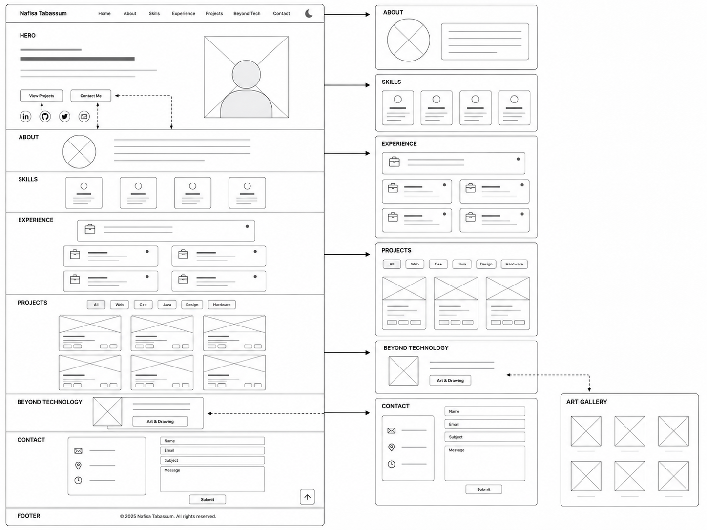

# Nafisa Tabassum - Personal Portfolio Website

## Project Overview

This project is my personal portfolio website which I made during my CS355 Internet and Web Technologies Course taking period. The goal of this website is to represent me professionally while also showing my personality, creativity, technical skills, experiences, and projects.

The website is built from scratch using HTML, CSS, JavaScript, and Bootstrap. It is a multi-section portfolio with a separate art gallery page. The main page includes Home, About, Skills, Experience, Projects, Beyond Technology, and Contact sections. The website is also responsive, so it works on desktop, tablet, and mobile screens.

## GitHub Repository and Live Website

- GitHub Repository: https://github.com/T-nafisa/Nafisa_Tabassum_Portfolio
- Live Website: https://t-nafisa.github.io/Nafisa_Tabassum_Portfolio/

---

# Part 1: Content

## 1. What is your full name as you want it displayed professionally?

Nafisa Tabassum

## 2. What is the purpose of your portfolio website?

The purpose of my portfolio website is to give a professional highlight and visual representation of who I am. I want it to showcase my skills, experiences, projects, interests, hobbies, and photos so that recruiters, professionals, mentors, and other visitors can get a better understanding of me beyond a one-page resume.

Through this website, I hope to share not only the technical skills that I have developed as a Computer Science student, but also the creativity, curiosity, and determination that shape who I am. It would work as a space where visitors can explore my work, learn about my experiences, discover my interests beyond technology, and gain a better understanding of my personality, values, and career goals.

Ultimately, I want this portfolio to reflect both the professional and personal sides of my journey while creating meaningful connections with recruiters, mentors, collaborators, and fellow learners.

## 3. Who is the target audience?

The target audience for my portfolio website is mainly:

The target audience would primarily be hiring managers, employers, recruiters, and professionals in the technology industry, because this portfolio can represent me visually and personally in a way that a one-page resume cannot fully do.

However, it would also be for mentors, collaborators, and fellow students who may be interested in my projects, experiences, or growth. I want visitors to leave my portfolio with a clear understanding about me in a professional setting.

## 4. What skills do you want to highlight?

I want to highlight both technical and professional skills.

Technical skills I highlight:

As a Computer Science student, I want to highlight both my technical and professional skills.

On the technical side, I want to showcase my skills in web development, software development, problem solving, object-oriented programming, database work, API integration, and user-focused design. I have experience working with C++, Java, HTML, CSS, JavaScript, Prisma, PostgreSQL, Git, GitHub, and other development tools.

Beyond technical skills, I want to also highlight communication, documentation, collaboration, technical troubleshooting, project organization, creativity, and the ability to learn quickly in different environments.

## 5. What projects or work will you showcase?

I will showcase the following projects and work:

1. StateWise USA  
   A basic full-stack web application from The Build Fellowship that helps users explore U.S. state information, weather, and outdoor activity features.

2. 8 Queens Visual Game  
   A C++ 8 Queens puzzle project from CS211 that I later made visual using HTML, CSS, and JavaScript.

3. Commvault Prototype  
   A UX prototype project created during my Commvault sprinternship. My team studied backend data dashboard pain points and proposed a clearer workflow for users.

4. C++ Advanced OOP-Algorithmic Projects  
   A collection of C++ projects involving object-oriented programming, dynamic programming, backtracking, algorithms, and pointers.

5. Java OOP Projects  
   Java object-oriented programming projects and mini game projects using Java algorithms, GUI concepts, and Java Swing.

6. Logic Circuits  
   Digital logic circuit design practice using Logisim, including logic gates and circuit simulations.

I also showcase my experience through internship and fellowship cards, including CUNY Career Launch, RICH, NYC Department of Education DIIT, Commvault, The Build Fellowship, and MDLand iClinic.

## 6. How will you describe yourself in a short professional bio?

An Art and science enthusiast CS undergrad student who’s aspiring to be a software engineer. I like exploring everything from system logic to user experience because I believe great software is not just powerful; it should also be intuitive, useful, and meaningful.

I enjoy learning new things, applying them through real projects, and watching an idea turn into something useful. I am interested in building solutions that are not only functional, but also accessible, meaningful, and helpful for the people who use them.

Beyond technology, I also enjoy art, design, drawing, music, singing, and playing instruments. I believe creativity helps me approach technical problems in a more thoughtful and human-centered way.

I am currently exploring opportunities in software engineering, web development, data-driven technologies, and user-centered design while continuing to grow as a developer and lifelong learner.

## 7. What pages will your site include?

My website will include:

- Home
- About
- Skills
- Experience
- Projects
- Beyond Technology
- Contact
- Art Gallery page

The Home page introduces me with my name, role, photo, social links, and call-to-action buttons. The About section gives a longer personal and professional bio. The Skills section shows my technical and professional skills. The Experience section shows internships, fellowships, and work experience. The Projects section shows my technical and design projects. The Beyond Technology section links to my Art Gallery page. The Contact section includes a contact form and email link.

## 8. What is your career goal or desired role?

My main career goal is to become a software engineer. I want to build useful and meaningful technology that can help people.

I am also interested in web development, full-stack development, data-driven technologies, user experience, and user-centered design. I want to keep growing as a developer while exploring both the technical and creative sides of technology.

## 9. What technologies or tools do you have experience with?

I have experience with:

I have experience with HTML, CSS, JavaScript, C++, Java, Prisma, PostgreSQL, Git, GitHub, Microsoft Office, Google Workspace, and basic project management tools.

I also have experience with object-oriented programming, web design, frontend development, technical documentation, technical troubleshooting, and logic-based problem solving.

## 10. What achievements or experiences are worth highlighting?

Some of the experiences and achievements that have significantly shaped my journey include:

-  Dean's List recognition at Queens College
- Software Engineering Intern at Reach Into Cultural Heights, Inc. (RICH)
- CUNY Tech Support Intern at NYC Department of Education DIIT
- UX Design Sprintern at Commvault
- full-stack development experience from The Build Fellowship.

## 11. What call-to-action should visitors take?

The main actions I want visitors to take are:

- view my projects
- visit my GitHub
- connect with me on LinkedIn
- contact me through the form
- email me for opportunities or collaboration

The main call-to-action buttons on the homepage are View Projects and Contact Me.

## 12. Will you include a resume? In what format?

For this version of the portfolio, I will not including a separate resume file. The website itself presents my skills, experience, projects, contact information, and professional background in a visual way.

In the future, I may add a downloadable PDF resume button if needed.

## 13. What social or professional links will you include?

I include:

- Email
- GitHub
- LinkedIn

---

# Part 2: Design

## 1. What overall style will best represent you?

The overall style will be professional, creative, modern, and slightly playful. I wanted the website to look organized and professional, but not too plain. Since I am a Computer Science student who also likes art and creativity, I want the design to show both sides.

## 2. What color scheme will you use and why?

I will use a dark navy theme with soft purple, lavender, grey and blue accents. I also will add a light mode theme with a soft light background and darker text.

I choose this color scheme because dark navy gives the website a modern technology-focused look. The purple, light pink, and soft blue accents make it more creative and personal. The light mode will give visitors another comfortable option if they prefer a brighter design.

## 3. What fonts will you use for headings and body text?

I will use Arial and Helvetica as the main fonts. These fonts are simple, readable, and available in most browsers without needing extra font downloads.

For headings, I will use bold styling, larger sizes, and strong spacing to make important sections stand out. For body text, I will use readable sizes, line height, and enough contrast.

## 4. How will your design reflect your personality or field?

The design will reflect my field by using structured sections, project cards, technology icons, GitHub links, and a professional layout. It will show my Computer Science background through the Skills, Experience, and Projects sections.

At the same time, it will reflect my personality through soft colors, personal photos, drawings, creative visuals, and a “Beyond Technology” section. Since I am interested in both Computer Science and creativity, the design will show that I am technical, but also a bit artistic.

## 5. What layout will your homepage follow?

The homepage will follow a single-page scrolling layout.

The order will be:

1. Navigation bar
2. Hero section with name, role, photo, social links, and buttons
3. About Me
4. Skills
5. Experience
6. Projects
7. Beyond Technology
8. Contact
9. Footer

There will be also a separate Art Gallery page connected from the Beyond Technology section.

## 6. How will you organize project sections visually?

The project section will be organized using card components. Each project card will include:

- project image
- project title
- short description
- technology badges
- GitHub link
- live demo link when available

I will also add project filter buttons so visitors can filter projects by category, such as Web, C++, Java, and Design.

## 7. Will the site be mobile-friendly? How will you ensure responsiveness?

Yes, the website will be mobile-friendly. I will use Bootstrap grid classes, Flexbox, relative widths, and CSS media queries. On larger screens, content can appear side by side. On smaller screens, sections stack vertically so the website remains readable and clean.

The navigation also will become a mobile menu on smaller screens, using Bootstrap’s navbar collapse feature.

## 8. What visual hierarchy will guide visitors?

The visual hierarchy will start with the hero section, where visitors see my name, role, photo, and main buttons first. Then the page will move into more detailed sections like About, Skills, Experience, Projects, Beyond Technology, and Contact.

I will use large headings, cards, icons, buttons, badges, spacing, and accent colors to guide visitors from the most important information to the supporting details.

## 9. How will consistency be maintained across pages?

I will use the same color palette, fonts, button styles, card styles, spacing, and section headings throughout the website.

Also I will use semantic HTML elements, keep the HTML document organized, group related content together, and reuse CSS classes for repeated components such as buttons, cards, project sections, and navigation links.

## 10. How will accessibility be considered?

By using strong contrast, readable font sizes, clear section headings, simple navigation, and alt text for images.

I plan to include both dark mode and light mode, I will make sure both themes are readable and comfortable for users. The dark mode will use a dark navy background with light text, while the light mode will use a soft light background with darker text.
I will add a mode-toggle icon so visitors can switch between dark and light themes. This will make the website more flexible and user-friendly.

## 11. Will you use icons, images, or illustrations? Why?

Yes. I will use icons, images, and visual elements because they make the website easier to understand and more personal.

I will use Font Awesome icons for navigation-related visuals, skills, experience, social links, buttons, and contact elements. I will use personal photos for the hero and about sections. I will use project screenshots for the project cards. I also will use my own artwork in it.

## 12. What portfolio websites inspired your design?

My design is inspired by portfolio websites that use dark themes, clean layouts, soft accent colors, project cards, and creative visual sections.

I was especially inspired by portfolio styles that combine technology and creativity together. I wanted my website to feel professional like a developer portfolio, but also personal enough to show my artistic side.

---

# Part 3: Interactivity

## 1. What interactive elements will your site include?

The website will have:

- responsive navigation menu
- navigation links
- hero buttons
- social media and email links
- dark/light theme toggle
- project filter buttons
- project GitHub and live demo links
- contact form
- back-to-top button
- scroll reveal animation
- click sparkle effect
- hero photo dissolve animation
- art gallery image preview by opening images in a new tab

## 2. Will your site include a contact form? How will it work?

Yes, the website will have a contact form. The form asks for:

- name
- email
- subject
- message

The form will use labels, placeholders, and required fields. It will use FormSubmit to send messages to my email. JavaScript also will check that the fields are filled in and that the email looks valid before the form is submitted.

## 3. What JavaScript features will you implement?

The JavaScript features Some features I plan to add:

- dark/light theme toggle
- saving the selected theme in localStorage
- closing the mobile menu after clicking a nav link
- contact form validation
- back-to-top button
- project filtering
- scroll reveal animation
- click sparkle animation
- clickable hero photo dissolve animation
- keyboard support for the hero photo animation
- art gallery image click preview

## 4. How will users receive feedback from interactions?

Users will receive feedback through:

- button hover effects
- card hover effects
- active project filter button style
- alert messages for contact form validation
- theme toggle visual change
- scroll reveal animation
- back-to-top button appearing after scrolling
- project cards hiding or showing when filters are clicked
- sparkle effect when clicking on the page
- hero image animation when clicked or activated by keyboard

## 5. How does interactivity improve the user experience?

Interactivity makes the website more useful and engaging. Visitors are not only reading static information; they can explore projects, switch the theme, use the contact form, open project links, filter projects, return to the top easily, and view artwork.

These features make the portfolio feel more polished, personal, and user-friendly.

---

# Main Sections

## Project Overview

This website is a personal portfolio for Nafisa Tabassum. It introduces me professionally, shows my technical and creative skills, presents my projects and experiences, and gives visitors a way to contact me.

## Target Audience

The target audience includes recruiters, employers, hiring managers, mentors, classmates, collaborators, and other professionals who may want to learn about my work and background.

## Content Strategy

The content is organized so visitors can quickly understand who I am, what I know, what I have done, and how to contact me.

The strategy is:

1. Start with a clear introduction in the Home section.
2. Explain my background and goals in About.
3. Show skills in simple categories.
4. Show professional experience using cards.
5. Present projects with screenshots, technologies, and links.
6. Add a creative Beyond Technology section to show personality.
7. End with a contact form and professional links.

## Information Organization

The website is organized in a top-to-bottom scrolling structure:

- Home
- About
- Skills
- Experience
- Projects
- Beyond Technology
- Contact

There is also a separate Art Gallery page linked from the Beyond Technology section.

## Visual Design

The visual design uses a dark navy background, light text, pastel accents, rounded cards, icons, project screenshots, and smooth hover effects. The design is meant to be modern, readable, professional, and creative.

The project and experience sections use card layouts to keep information clean and organized. The light/dark mode toggle gives users control over the viewing style.

## Wireframe Design

The planned wireframe follows this structure:

## Interaction / Functionality

The website includes meaningful interactions such as navigation, theme switching, project filtering, form validation, scroll reveal effects, back-to-top behavior, click sparkle effects, and interactive image previews.

The contact form uses FormSubmit as a simple frontend-friendly form service.

## Technical Overview

The main files are:

- `index.html` - main portfolio page
- `art.html` - separate art gallery page
- `style.css` - custom styling, layout, responsive design, dark/light mode, animations
- `script.js` - theme toggle, project filter, form validation, scroll effects, back-to-top, and image interactions
- `assets/` - images, project screenshots, drawings, and other media

Technologies used:

- HTML5
- CSS3
- JavaScript
- Bootstrap 5
- Font Awesome
- FormSubmit
- GitHub Pages

## Project Milestones

| Milestone | Description                                                                                                         |
|---|---------------------------------------------------------------------------------------------------------------------|
| Planning | Prepared project content, design, and interactivity questions.                                                      |
| Wireframe | Planned the structure of the homepage, project cards, and contact section.                                          |
| HTML Development | Created the main page sections and art gallery page.                                                                |
| CSS Styling | Designed the dark theme, light mode, cards, buttons, spacing, and responsive layout.                                |
| JavaScript | Added theme toggle, project filtering, form validation, back-to-top button, reveal effects, and image interactions. |
| Accessibility Review | Added semantic HTML, alt text, aria labels, readable colors, and responsive behavior.                               |
| Testing | Checked layout on different screen sizes and tested navigation, buttons, form, and theme toggle.                    |
| Deployment | Uploaded files to GitHub and hosted the website using GitHub Pages.                                                 |

---

# External Resources Used

- Bootstrap 5.3.8  
  Used for responsive grid, navbar, buttons, and basic layout support.  
  https://getbootstrap.com/

- Font Awesome 6.5.1  
  Used for icons in the navbar, skills, experience, buttons, contact, and social links.  
  https://fontawesome.com/

- FormSubmit  
  Used to connect the frontend contact form to email without a custom backend.  
  https://formsubmit.co/

- GitHub Pages  
  Used to host the final portfolio website.  
  https://pages.github.com/

- Coolors  
  Used as inspiration for color palette planning.  
  https://coolors.co/

All main HTML, CSS, and JavaScript code was written for this project. No full website template was used.

---

# Accessibility

I designed the website to be accessible and responsive. The site includes semantic HTML, image alt text, readable color contrast, light and dark modes, form labels, aria labels, and responsive layouts for desktop and mobile screens.

The website also includes creative decorative elements. These are marked as decorative where possible so they do not distract from the main content.

---

# Final Reflection

This portfolio website helped me bring together my technical skills, professional experiences, projects, and creative interests in one place. I wanted it to feel professional enough for recruiters and employers, but also personal enough to show who I am beyond just coursework and job titles.

Through this project, I practiced HTML structure, CSS styling, Bootstrap layout, JavaScript interactivity, accessibility, responsive design, and GitHub Pages deployment. I also learned how important it is to plan content, design, and interactivity before building a website.
